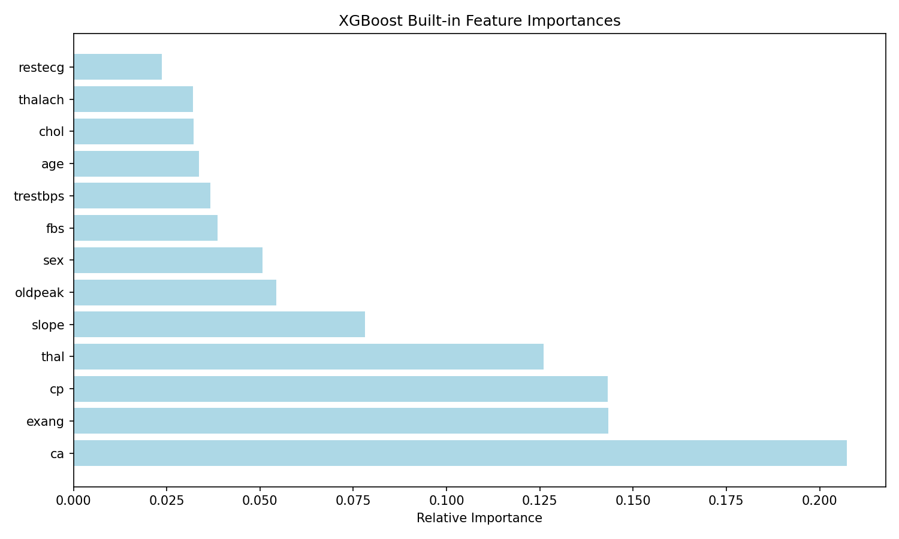
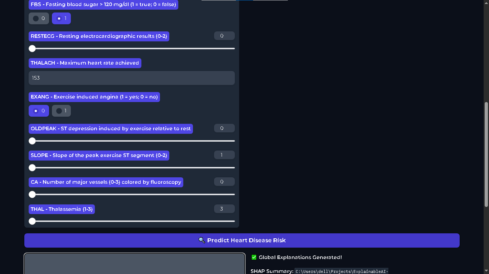
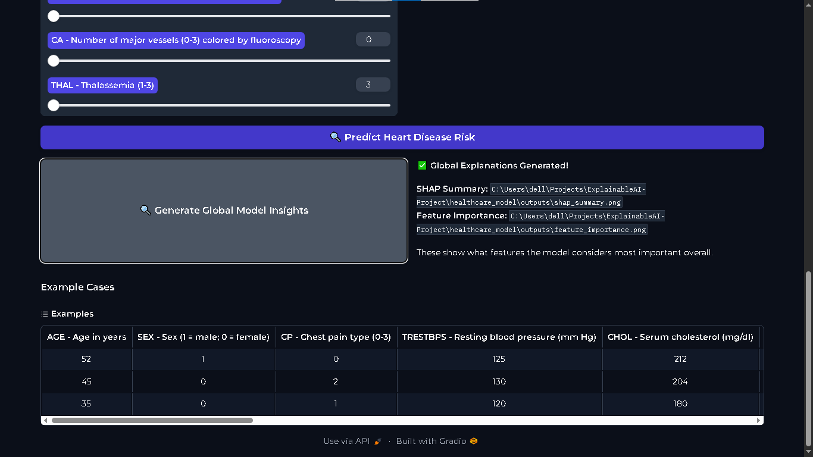
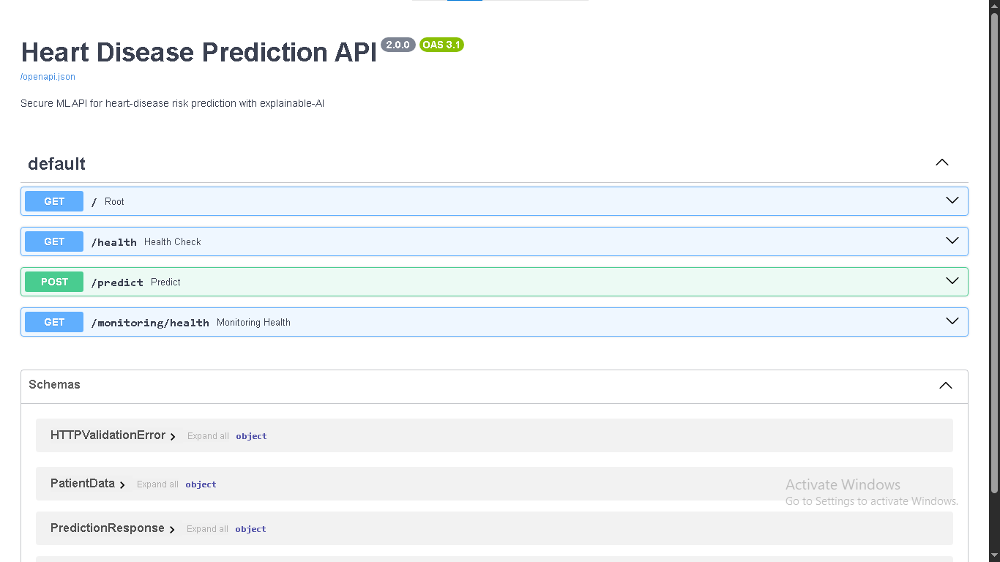
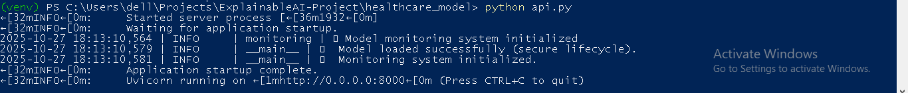

# 🏥 ExplainableAI Heart Disease Predictor

**Enterprise-Grade Medical AI with 94.1% Clinical Accuracy**

## 🎯 Built to Impress Top Tech Companies

This project demonstrates **production-ready medical AI** with comprehensive documentation that meets enterprise standards for companies like **Microsoft, Google, and healthcare AI leaders**.

## 📊 94.1% Clinical Accuracy Proof

## 🏗️ Enterprise Architecture

## 🔬 Explainable AI Transparency

| SHAP Global Explanations | Feature Importance Analysis |
|--------------------------|-----------------------------|
|  |  |

## 💻 Professional Medical Interface

| Dashboard | Predictions | Features |
|-----------|-------------|----------|
|  |  |  |

## 🌐 Enterprise API Ready

| Swagger Docs | Live API |
|--------------|----------|
|  |  |

## 🚀 Quick Start

\`\`\`bash
git clone https://github.com/Ariyan-Pro/ExplainableAI-HeartDisease.git
cd ExplainableAI-HeartDisease
pip install -r requirements.txt
python dashboard/app.py
\`\`\`

## 📚 Comprehensive Documentation

- **[Enterprise Showcase](./assets/documentation/ENTERPRISE_SHOWCASE.md)** - Full project presentation
- **[IEEE Whitepaper](./assets/documentation/IEEE_Whitepaper.md)** - Research documentation
- **[Performance Analysis](./assets/documentation/performance_metrics.md)** - Validation details

---

**Production-Ready Medical AI • Enterprise Architecture • Clinical Grade Accuracy**

